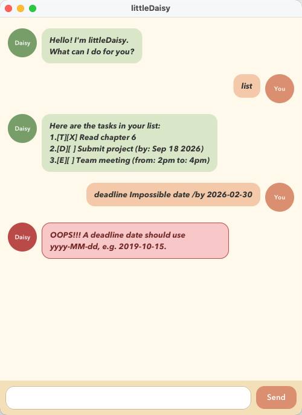

# littleDaisy User Guide



littleDaisy is a cheerful desktop task manager for people who prefer fast,
keyboard-friendly commands. It remembers your todos, deadlines, and events
between sessions. Type a command into the box at the bottom and press **Enter**
or click **Send**.

## Getting help

Enter `help` to display a concise reference for every command supported by
littleDaisy. The reference includes the arguments expected by each command and
the `yyyy-MM-dd` date format used by deadlines.

Example: `help`

```text
Here are the commands I understand:
  todo <description>
  deadline <description> /by <yyyy-MM-dd>
  event <description> /from <start> /to <end>
  list
  find <keyword>
  mark <task number>
  unmark <task number>
  delete <task number>
  help
  bye
```

## Adding tasks

Add a task using one of these commands:

- `todo <description>` for a task without a date
- `deadline <description> /by <yyyy-MM-dd>` for a dated task
- `event <description> /from <start> /to <end>` for an event

Examples:

```text
todo read chapter 6
deadline submit report /by 2026-09-25
event project meeting /from Friday 2pm /to Friday 4pm
```

Dates must be real calendar dates in `yyyy-MM-dd` format. littleDaisy rejects
empty descriptions, missing command options, invalid dates, repeated options,
and duplicate tasks without changing your list.

## Viewing and finding tasks

Use `list` to show every task, or `find <keyword>` to show tasks whose
descriptions contain the keyword. Search is not case-sensitive.

```text
list
find report
```

The symbols `[T]`, `[D]`, and `[E]` identify todos, deadlines, and events.
`[X]` means a task is complete; `[ ]` means it is not complete.

## Updating tasks

The task number is the number shown by `list`.

- `mark <task number>` marks a task as complete.
- `unmark <task number>` marks a task as incomplete.
- `delete <task number>` permanently removes a task.

For example:

```text
mark 2
unmark 2
delete 1
```

littleDaisy reports a clear error if the number is missing, is not numeric, or
does not identify a task in the current list.

## Saving data

Tasks are saved automatically after every change in `data/littleDaisy.txt`.
If the file does not exist on first launch, littleDaisy starts with an empty
list and creates it when you add a task. Do not edit the data file while the
application is running.

## Exiting

Enter `bye` to see littleDaisy's goodbye message. You can then close the
window. All earlier changes have already been saved.
